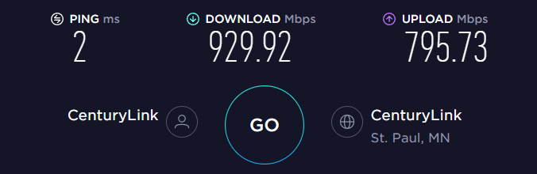
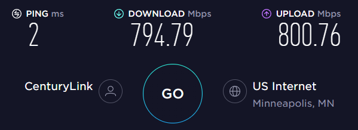
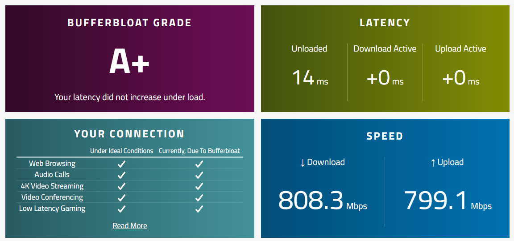

So You Want To Build a Raspberry Pi Router
===

With the increasing prevalence of gigabit-speed internet connections in the US and elsewhere comes the need for routers offering higher performance than many consumer "all-in-one" devices can offer. This is especially true for users who wish to take advantage of advanced traffic shaping technologies like SQM which is notoriously CPU-intensive. The Raspberry Pi 4 single-board computer is affordable, ubiquitous, and runs circels around any consumer device remotely near its price point. All of these qualities make it an ideal candidate to become the next foundation of your home network.

What It's Good For
===

* Full gigabit routing performance with SQM disabled. The CPU is certainly capable of much more, limited only by the speed of the network interfaces.
* ~800 Mbps up/down with SQM enabled.
* Oodles of extra RAM and processing power for running additional services if you're so inclined.
* Doing all of the above with no moving parts, low power consumption and in a very compact footprint, at a very competitive price.

What It's Not So Good For
===

* Servicing your wireless devices. The Pi's onboard WiFi implementation is truly pitiful compared to a decent all-in-one consumer router. Instead, plan on supplementing the Pi with another device to serve as a wireless access point.

What You'll Need
===

* A Raspberry Pi 4 board. 1GB of RAM will be plenty for this application but more won't hurt.
* Power supply or PoE hat.
* A quality microSD card of any commonly available size; even 8GB is an *enormous* amount of space compared to your average plastic consumer network router.
* A case designed for passive cooling. Here are a few options you might consider:
  * [Flirc](https://www.microcenter.com/product/639582/flirc-raspberry-pi-4-case-silver)
  * [Argon40 One](https://www.microcenter.com/product/618002/argon40-one-aluminum-raspberry-pi-case)
  * [Argon40 Neo](https://www.microcenter.com/product/618003/argon40-neo-raspberry-pi-4-case)
  * [Geekworm Armor](https://www.amazon.com/Geekworm-Raspberry-Computer-Aluminum-Compatible/dp/B07VD6LHS1/)
* A USB-to-Ethernet interface. Any dongle based on the `RTL8153` chipset will do. The [TP-Link UE300](https://www.microcenter.com/product/496684/tp-link-usb-30-to-gigabit-ethernet-network-adapter) is a popular choice and works very well.

> It's possible to use the Pi in a so-called "router-on-a-stick" configuration using only the single onboard Ethernet port in conjunction with VLANs. This configuration requires the use of a managed switch and is beyond the scope of this guide.

Example Build and Total Cost
===

* Raspberry Pi 4 2GB: **$35**
* Inland USB-C power supply: **$6**
* Micro Center 64GB microSD card: **$7**
* Argon Neo case: **$15**
* TP-Link UE300: **$14**

Total: **$77**

> Note that due to the ongoing global unpleasantness the 2GB Pi 4 recently suffered a price bump to $45. This is said to be a temporary measure but for the time being I feel the 4GB version is a better value at $55. Opting for the 4GB board will bring the total build cost to **$97**.

Getting Started
===

With your Pi assembled it's time to write an OpenWRT image to your microSD card. One option is to use [wulfy23's popular build](https://github.com/wulfy23/rpi4) which should get you up and running with minimum fuss. Another is to use the stock image OpenWRT provides; however the stock image lacks a driver for the USB dongle. The last, and the one we'll explore here, is to build a customized image with the needed packages. Luckily for us the ASU (**A**ttended **S**ys**U**pgrade) project features a handy web frontend where we can do just that.

To get started, navigate to the ASU server at https://asu.aparcar.org/. Start typing `Raspberry Pi 4` into the search field and select `Raspberry Pi 4B/400/4CM (64bit)`. Now expand the `Customize` accordion.

We are now free to add additional packages to our firmware image. Nice! There's really only one that is absolutely necessary to get this thing off the ground: `kmod-usb-net-rtl8152`. Go ahead and add that to the end of the list.

Click `Request Build` and go top up your coffee while you wait for your image to be built. Once it's ready, download the `FACTORY (EXT4)` image. Decompress the gzipped image and finally flash it to your microSD card using the tool of your choice.

Getting Online
===

Connect your Pi's onboard Ethernet port to your LAN. Connect your WAN connection to the USB dongle, but ***DO NOT*** connect it to the Pi just yet. Navigate to `http://192.168.1.1` in your browser and log in without a password. **Immediately** do the following:

* Navigate to `System -> Administration -> Router Password` and configure a **strong** password.
* Navigate to `System -> Administration -> SSH Access` and configure the SSH server to listen only on the `LAN` interface.
* If desired, provide a public key for SSH login in `System -> Administration -> SSH-Keys`

Now that LuCI (OpenWRT's web-based configuration interface) and SSH have both been locked down you may connect the USB Ethernet dongle. Navigate to `Network -> Interfaces -> Devices` and confirm that you see a new `eth1` device. If you don't, restart your router from `System -> Reboot`.

Click back to the `Interfaces` tab. Add a new interface called `WAN` using the correct protocol for your internet service and attach it to the new `eth1` interface. Complete any additional configuration steps based on your chosen protocol, then save and apply your changes.

> If your ISP requires your WAN device to communicate over a specific VLAN, use the "custom" device field to provide the VLAN ID in the form `DEVICE.VLANID`, e.g. `eth1.10`.

You should now be connected to the Internet!

Maximizing Performance
===

In its current configuration your router will effortlessly route a symmetric gigabit connection. However, there are a handful of things we can do to wring even more performance out of the Pi.

Configuration Tweaks
---

* Navigate to `Network -> Interfaces -> Global network options` and enable `Packet Steering`. This feature helps ensure that all packets belonging to a particular flow are handled by the same processing core, enhancing performance. See [here](https://lwn.net/Articles/362339/) for a helpful introduction to the concept.

* Navigate to `Network -> Firewall` and verify the `Software flow offloading` setting. If you intend to use SQM you will want to leave this feature disabled. If you will not be using SQM go ahead and enable it now.

Enabling `irqbalance`
---

IRQs are the mechanism by which your network interfaces inform the operating system that there is work to be done. By default these requests will be handled by a single CPU core which can result in a bottleneck in situations where the lone core can't keep up.

This is where the `irqbalance` package comes in. This daemon monitors processor load and IRQ volume and distributes the IRQs across different CPU cores, easing the bottleneck.

Using `irqbalance` is as straightforward as it gets: just install it from `System -> Software` and either reboot the router or manually start the service from `System -> Startup` to ensure that the daemon is running. You should now see an `irqbalance` process in `Status -> Processes`.

Overclocking the CPU
---

Your new router's CPU can be overclocked to 2 GHz with a simple configuration change. Do the math - that's a 33% performance bump across all cores *for free*! While the higher frequency will necessarily translate to more heat, a quality case designed for passive cooling or any active cooling solution should have no trouble keeping your Pi at a comfortable temperature.

> While even higher overclocks are possible (and despite conventional wisdom [will no longer void your warranty](https://forums.raspberrypi.com/viewtopic.php?p=1718810#p1718810) as of the Pi 4) I think the extra juice is unlikely to be worth the squeeze for most.

To enable the overclock simply add the following lines to the bottom of `/boot/config.txt`, then reboot:

```ini
over_voltage=6
arm_freq=2000
```

Putting it all together
===

Here are a handful of [Ookla](https://www.speedtest.net/) speedtests and [Waveform](https://www.waveform.com/tools/bufferbloat) bufferbloat tests to give you an idea of what you can expect both with and without SQM enabled.

Without SQM
---



With SQM
---

Settings:

```ini
sqm.eth1=queue
sqm.eth1.qdisc='cake'
sqm.eth1.debug_logging='0'
sqm.eth1.verbosity='5'
sqm.eth1.linklayer='ethernet'
sqm.eth1.overhead='44'
sqm.eth1.script='piece_of_cake.qos'
sqm.eth1.interface='pppoe-WAN'
sqm.eth1.download='850000'
sqm.eth1.upload='850000'
sqm.eth1.enabled='1
```





